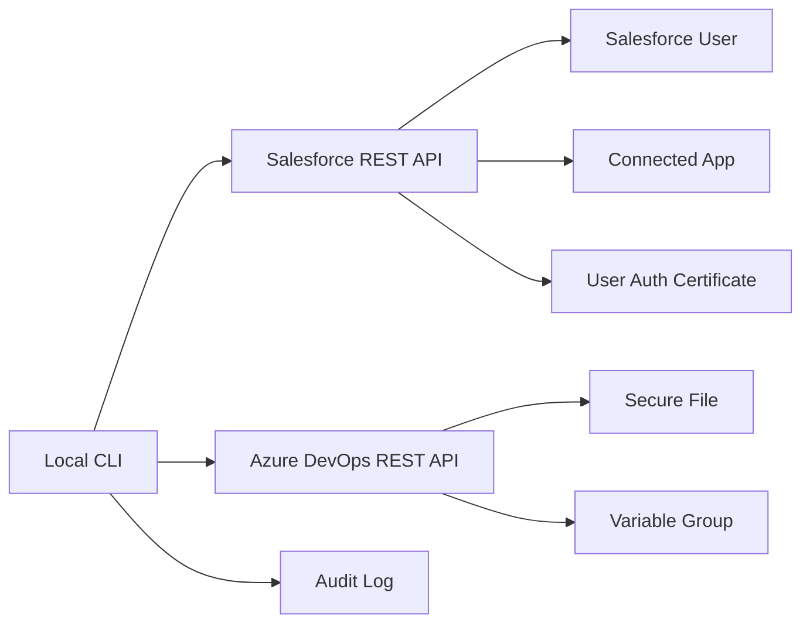
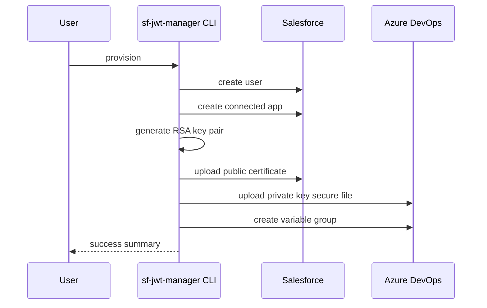

# Salesforce JWT Manager

A small TypeScript CLI for managing the Salesforce JWT integration lifecycle across Salesforce and Azure DevOps. It can provision a user + connected app, generate RSA keys, upload the public certificate to Salesforce, store the private key as an Azure DevOps secure file, and create the variable group used by downstream deployment or automation jobs.

## What the client does

The tool is designed for a typical JWT-based integration setup:

- creates or looks up a Salesforce user for the integration
- creates a Connected App in Salesforce
- generates a new RSA key pair
- uploads the public certificate to the Connected App
- uploads the private key to Azure DevOps as a secure file
- creates a variable group containing connection values used by pipelines
- supports key rotation and cleanup
- keeps a local audit log of operations

This helps keep the private JWT signing material out of source control while still exposing the values needed by application automation.

## Architecture



## Installation

1. Clone or open the repository in your workspace.
2. Install dependencies:

```bash
npm install
```

3. Copy the example environment file and fill in the values:

```bash
cp .env.example .env
```

4. Build the project:

```bash
npm run build
```

## Required environment variables

| Variable | Required | Description |
| --- | --- | --- |
| `ENVIRONMENT` | Yes | Logical environment name such as `dev`, `test`, `stage`, or `prod`. |
| `KEY_NAME` | Yes | Short logical identifier used to name the integration assets. |
| `SF_INSTANCE_URL` | Yes | Salesforce instance base URL, for example `https://my-domain.my.salesforce.com`. |
| `SF_API_VERSION` | Yes | Salesforce REST API version, usually `61.0` or similar. |
| `SF_PROFILE_ID` | No | Optional explicit Salesforce profile ID. If omitted, the app looks up the profile named `System Administrator` by default. |
| `SF_PROFILE_NAME` | No | Optional custom profile name to resolve when `SF_PROFILE_ID` is not provided. Defaults to `System Administrator`. |
| `AZDO_PROJECT` / `SYSTEM_TEAMPROJECT` | Yes | Azure DevOps project name that owns the secure file and variable group. |
| `AZDO_ORG_URL` / `SYSTEM_COLLECTIONURI` | Yes | Azure DevOps collection URI, typically the standard `$(System.CollectionUri)` value such as `https://dev.azure.com/your-org/`. This is the collection root, not a repo URL. |
| `AZDO_PAT` / `SYSTEM_ACCESSTOKEN` | Yes | Azure DevOps access token for secure files and variable groups. The standard pipeline variable is `SYSTEM_ACCESSTOKEN`; the app accepts it directly as the PAT-equivalent access token. |

Example:

```env
ENVIRONMENT="dev"
KEY_NAME="myintegration01"
AZDO_PROJECT="payments-platform"

SF_INSTANCE_URL="https://your-instance.my.salesforce.com"
SF_API_VERSION="61.0"
# Optional if you want to override the default profile lookup:
# SF_PROFILE_ID="00e0000001ABCDEF"
# Optional if you want a different profile name than System Administrator:
# SF_PROFILE_NAME="My Custom Integration Profile"

# In Azure Pipelines, these map to the predefined variables:
# SYSTEM_COLLECTIONURI and SYSTEM_ACCESSTOKEN
AZDO_ORG_URL="https://dev.azure.com/your-org/"
AZDO_PAT="YOUR_PAT"
```

## CLI usage

### Provision a full integration

```bash
export SF_ACCESS_TOKEN="your-salesforce-access-token"
npm run provision
```

You can also pass the token directly on the command line:

```bash
npm run provision -- --sf-access-token "your-salesforce-access-token"
```

This creates:

- Salesforce user
- Salesforce Connected App
- RSA key pair
- public certificate uploaded to the Connected App
- private key uploaded to Azure DevOps secure file
- variable group with integration values

### Rotate keys

```bash
export SF_ACCESS_TOKEN="your-salesforce-access-token"
npm run rotate
```

This generates a new key pair and replaces the certificate and secure file used by the JWT integration.

### Delete a full integration

```bash
export SF_ACCESS_TOKEN="your-salesforce-access-token"
npm run delete
```

This cleans up the Salesforce user, connected app, certificate, secure file, and variable group when present.

### List integrations

```bash
export SF_ACCESS_TOKEN="your-salesforce-access-token"
npm run list:integrations
```

This checks Salesforce first, then Azure DevOps, and prints a table summarizing the current integration state.

## Command flow



## Audit logging

Operations are recorded in files named like:

```text
audit-dev-myintegration01-payments-platform.json
```

These files store timestamps, results, and error details for each operation.

## Notes

- The tool expects a valid Salesforce access token for the operations that mutate or query Salesforce. This can be supplied as `SF_ACCESS_TOKEN` or via `--sf-access-token`.
- If `SF_PROFILE_ID` is not set, the tool will automatically query Salesforce for a profile matching `SF_PROFILE_NAME` (default: `System Administrator`) and use that profile ID for the integration user. This makes the default setup work without manually copying a profile ID from Salesforce.
- In Azure DevOps, the standard predefined variables are `SYSTEM_COLLECTIONURI`, `SYSTEM_ACCESSTOKEN`, and `SYSTEM_TEAMPROJECT`. The app accepts these directly as fallbacks for `AZDO_ORG_URL`, `AZDO_PAT`, and `AZDO_PROJECT`.
- The project uses the standard `SYSTEM_COLLECTIONURI` form rather than a `SYSTEM_COLLECTION_URI` variant.
- Azure DevOps secure file and variable group names are generated from the environment configuration.
- The current implementation is intended as a practical starting point and may need small adjustments to match your exact Salesforce org fields or Azure DevOps permissions.

## Development

```bash
npm run dev
```

This starts the CLI in watch mode using `tsx`.
